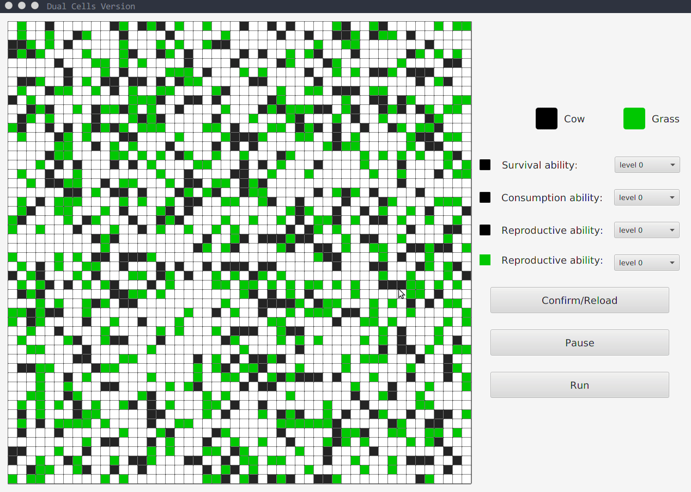
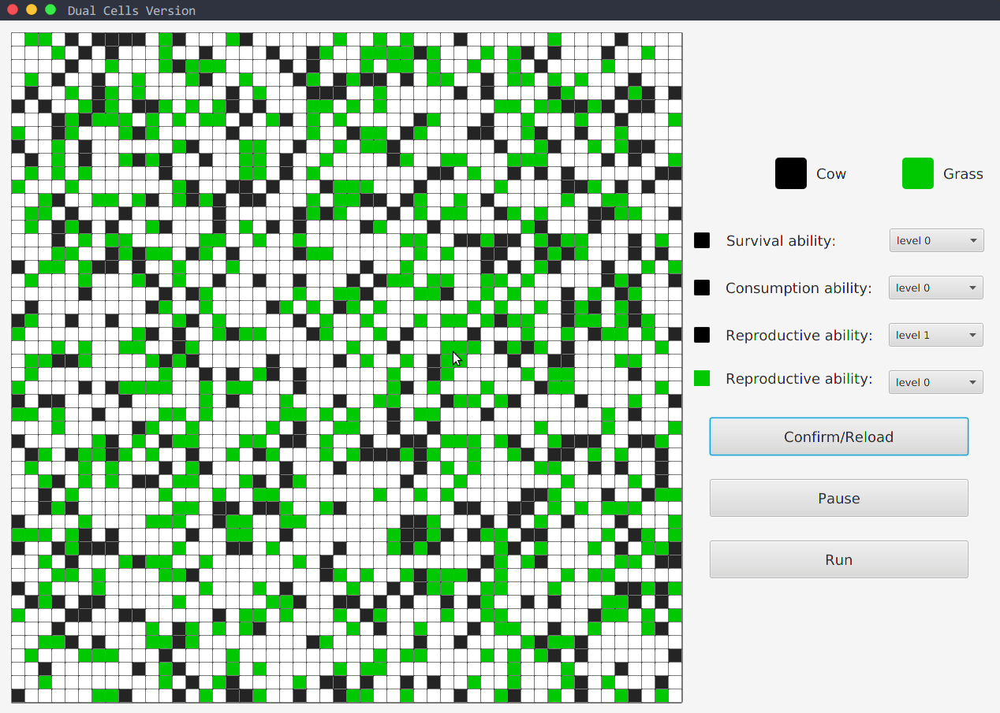
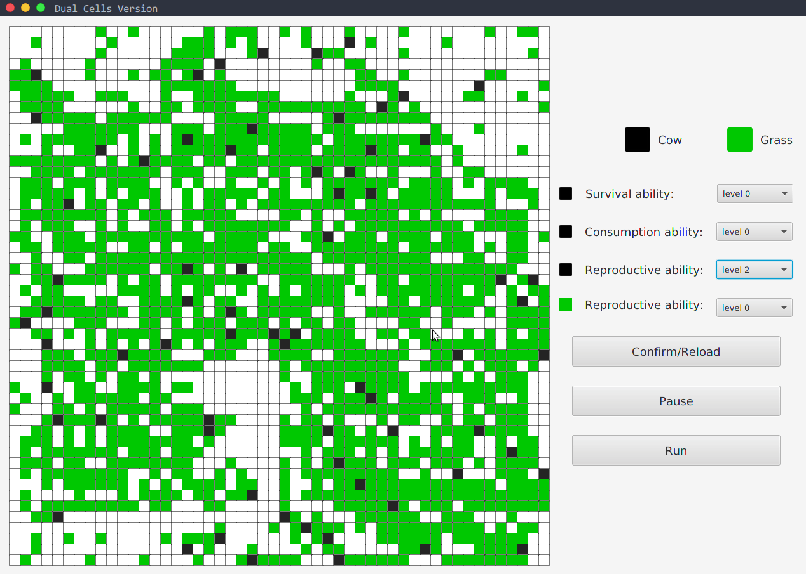
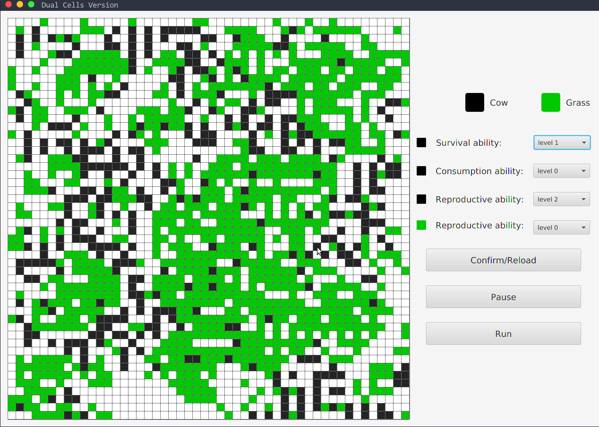
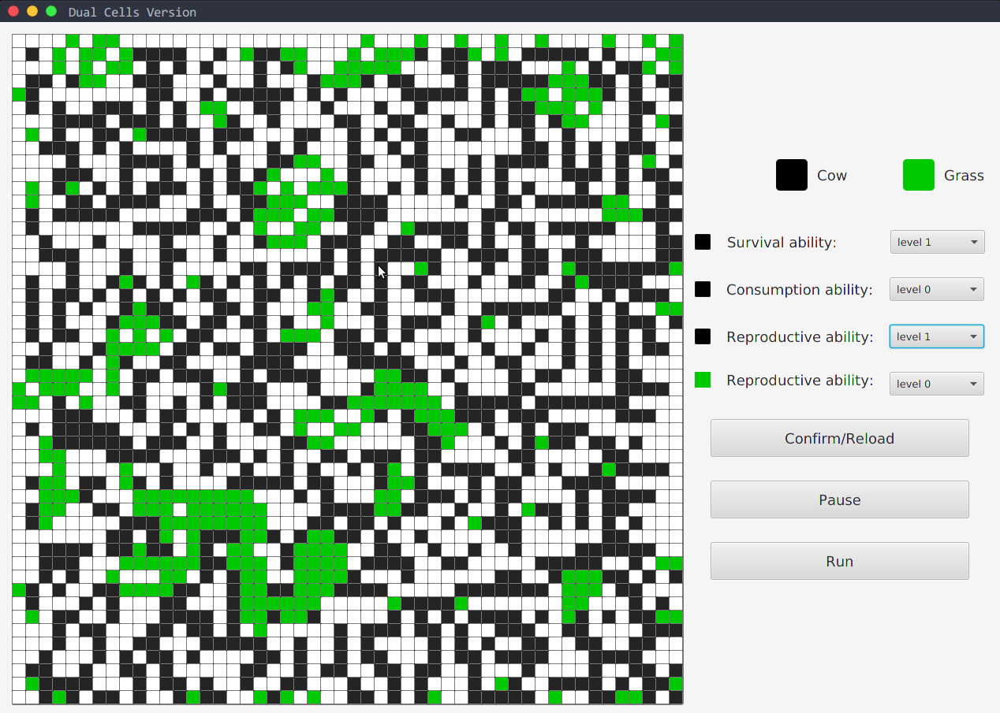
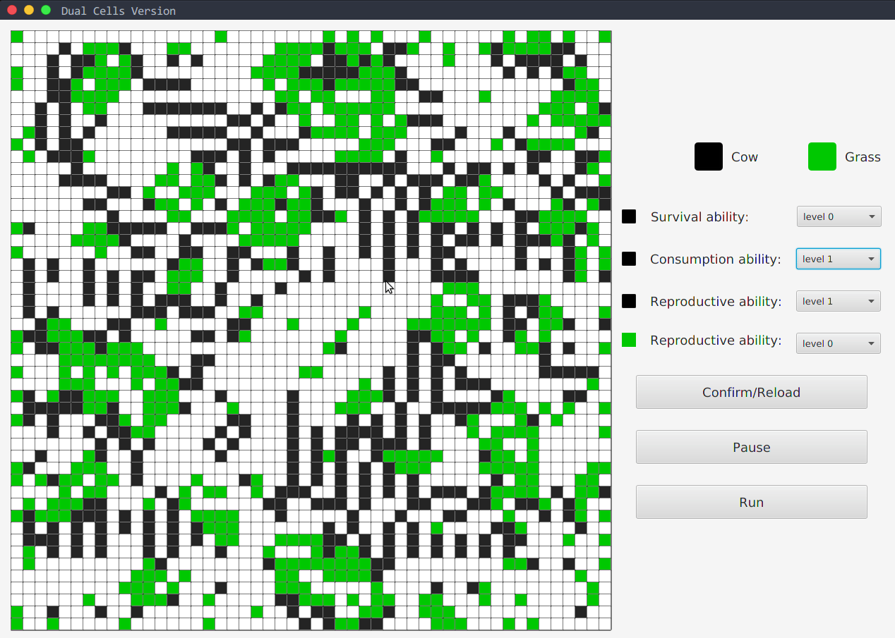
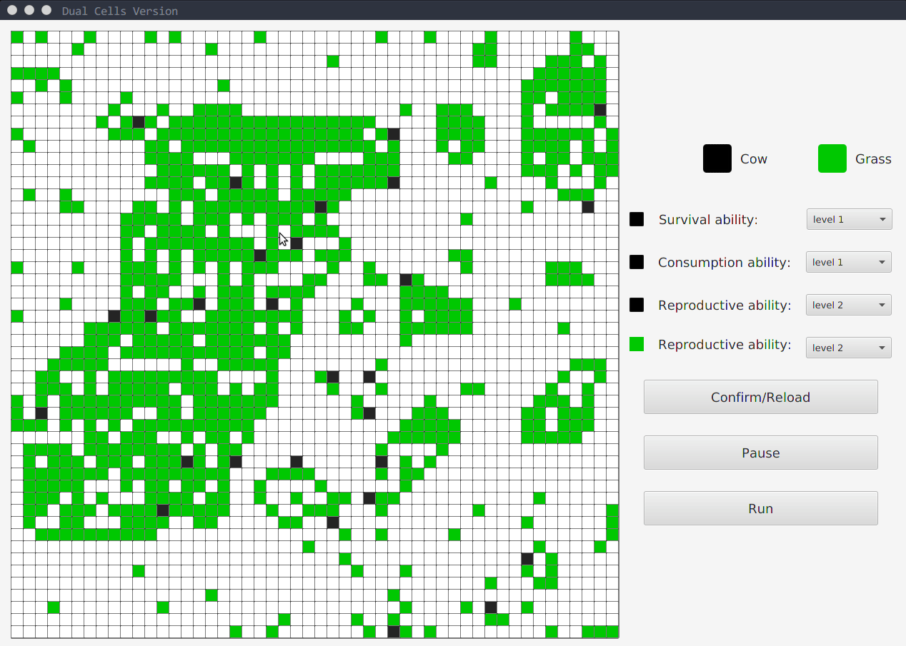
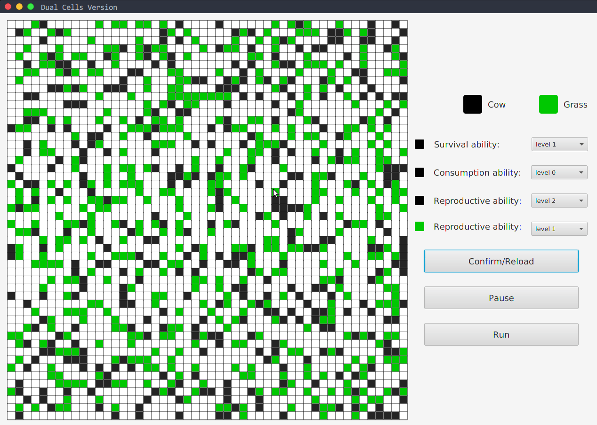

# 两种细胞的自动机
网格中存在两种不同的细胞，他们有着相互制约的关系。在[第一个版本](https://github.com/TYC6/cellular_automata)中，生存关系是提前制定好的，不能够对它进行修改，只提供了一些初始化的条件参数修改借口。这个版本对规则进行了开放，在生存规则框架不变的前提下，提供了对应的接口去修改其中具体的参数，来达到不同的演化方向。

## 具体的生存规则
对于这两种细胞，我赋予了他们现实的意义，一种细胞可以看成**牛**，另外一种可以看成**草**，他们自身都可以繁殖和灭亡，同时牛会以草为食。虽然这与现实中的牛吃草问题还有很大的差距，但这只是两种比喻而已，表示两种细胞具有捕食关系。当初决定模拟双细胞是突然想到了青霉素的发明过程——培养基上的青霉素和细菌。  

## 不同条件下的演化情况

## 对应的效果图
> 整个程序面板做的太大了，图片录制得有些卡顿

[图片1](#图片1) [图片2](#图片2) [图片3](#图片3) [图片4](#图片4)  
[图片5](#图片5) [图片6](#图片6) [图片7](#图片7) [图片8](#图片8) 

## 其它
理论上的网格是无限大才对，所以对于边界处的细胞来说，使用同一套生存规则是有问题的，但不影响整体的演化趋势。

## 相关图片
#### 图片1
[返回](#不同条件下的演化情况)  

#### 图片2
[返回](#不同条件下的演化情况)  

#### 图片3
[返回](#不同条件下的演化情况)  

#### 图片4
[返回](#不同条件下的演化情况)  

#### 图片5
[返回](#不同条件下的演化情况)  

#### 图片6
[返回](#不同条件下的演化情况)  

#### 图片7
[返回](#不同条件下的演化情况)  

#### 图片8
[返回](#不同条件下的演化情况)  
